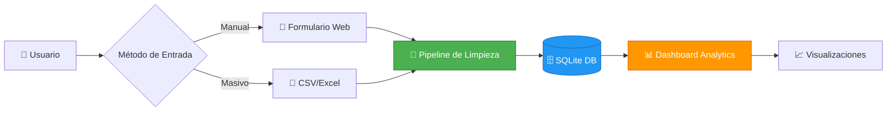
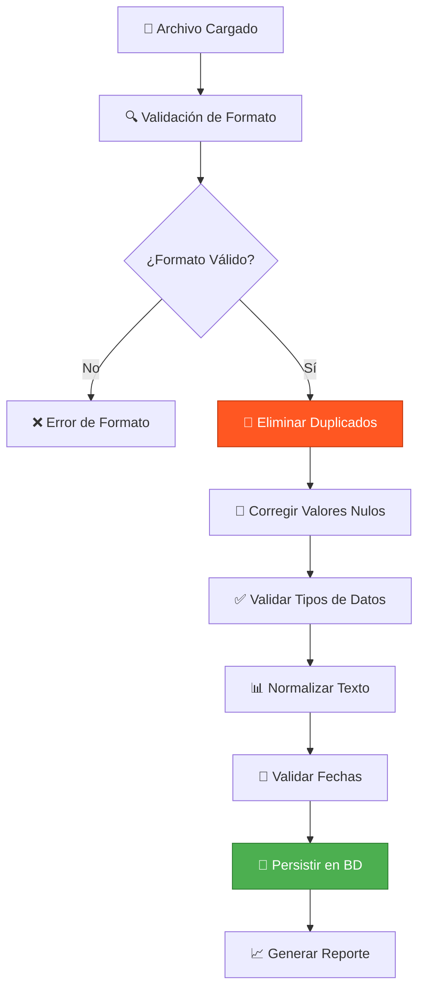
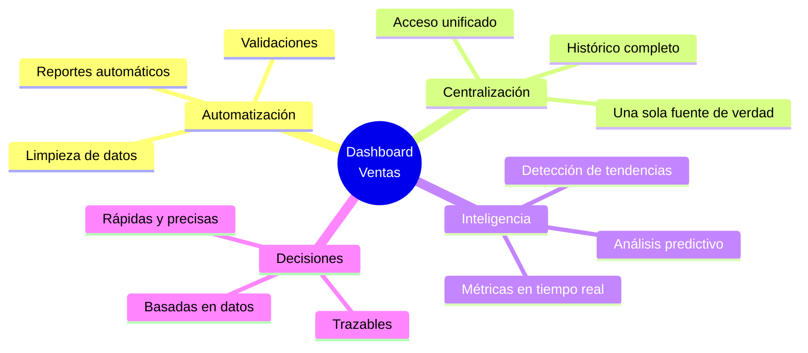

<div align="center">

# 🚗 Dashboard de Análisis de Ventas Automotrices

### Sistema inteligente de gestión y análisis de ventas vehiculares

[](https://www.python.org/)
[](https://flask.palletsprojects.com/)
[](https://pandas.pydata.org/)
[](LICENSE)

**[Características](#-características-principales) • [Instalación](#-instalación) • [Uso](#-guía-de-uso) • [Tecnologías](#-stack-tecnológico)**

</div>

---

## 📋 Descripción General

Plataforma web profesional desarrollada en **Flask** para la gestión integral de ventas automotrices. Combina registro manual y procesamiento masivo de datos con un potente motor de limpieza automática y visualización interactiva de métricas empresariales.

### 🎯 Propósito

Transformar datos crudos de ventas en insights accionables mediante:
- **Automatización** del proceso de limpieza de datos
- **Centralización** de registros de múltiples fuentes
- **Visualización** clara de tendencias y métricas clave
- **Validación** en tiempo real de información crítica

---

## ✨ Características Principales

<table>
<tr>
<td width="50%">

### 📝 Registro Inteligente
- Formulario web con validación en tiempo real
- Carga masiva mediante CSV/Excel
- Normalización automática de datos

</td>
<td width="50%">

### 🧹 Limpieza Automática
- Eliminación de duplicados
- Detección de valores nulos
- Corrección de formatos
- Validación de rangos numéricos

</td>
</tr>
<tr>
<td width="50%">

### 📊 Analytics Avanzado
- Gráficos de ventas por modelo
- Análisis de ingresos totales
- Distribución por versiones
- Tendencias temporales

</td>
<td width="50%">

### 🔍 Calidad de Datos
- Métricas de integridad
- Reportes de limpieza
- Trazabilidad de transformaciones
- Indicadores de eficiencia

</td>
</tr>
</table>

---

## 🛠 Stack Tecnológico

### Backend & Procesamiento

<p align="left">
  
  
  
  
</p>

### Visualización & Frontend

<p align="left">
  
  
  
  
</p>

### Arquitectura del Sistema



---

## 🗃️ Modelo de Datos

### Tabla: `ventas`

| Campo | Tipo | Descripción | Validación |
|-------|------|-------------|------------|
| `referencia` | TEXT | Marca y modelo del vehículo | Not Null |
| `version` | TEXT | Versión específica (Limited, SE, etc.) | Not Null |
| `anio` | INTEGER | Año de fabricación | 1900 - Año actual |
| `fecha_venta` | DATE | Fecha de la transacción | Formato ISO 8601 |
| `monto_total` | REAL | Valor total de la venta | > 0 |

---

## 🚀 Instalación

### Requisitos Previos

- Python 3.8 o superior
- pip (gestor de paquetes)
- Git

### Pasos de Instalación

```bash
# 1. Clonar el repositorio
git clone https://github.com/RogerCipa7/-Dashboard-de-Analisis-de-Ventas-Automotrices.git

cd dashboard-ventas-automotrices

# 2. Crear entorno virtual
python -m venv venv

# 3. Activar entorno virtual
# En Windows:
venv\Scripts\activate
# En Linux/Mac:
source venv/bin/activate

# 4. Instalar dependencias
pip install -r requirements.txt

# 5. Inicializar base de datos
python init_db.py

# 6. Ejecutar la aplicación
python app.py
```

### 📦 Dependencias Principales

```txt
Flask>=2.3.0
pandas>=2.0.0
numpy>=1.24.0
matplotlib>=3.7.0
seaborn>=0.12.0
openpyxl>=3.1.0
```

---

## 📖 Guía de Uso

### 1️⃣ Pantalla de Inicio

Accede al sistema en `http://localhost:5000` y selecciona tu método de carga preferido.

### 2️⃣ Registro Manual

**Formulario con Validación en Tiempo Real**

- Ingresa datos individuales de ventas
- Validación instantánea de campos
- Confirmación visual de registro exitoso

```python
# Ejemplo de registro
{
  "referencia": "Toyota Corolla",
  "version": "Limited",
  "anio": 2023,
  "fecha_venta": "2024-01-15",
  "monto_total": 25000.00
}
```

### 3️⃣ Carga Masiva (CSV/Excel)

**Pipeline Automático de Limpieza**



**Reglas de Limpieza Aplicadas:**

| Regla | Descripción | Acción |
|-------|-------------|--------|
| **Duplicados** | Registros idénticos por referencia + fecha | ❌ Eliminados |
| **Nulos Críticos** | Campos obligatorios vacíos | ❌ Descartados |
| **Montos Inválidos** | `monto_total <= 0` | ❌ Filtrados |
| **Fechas Futuras** | `fecha_venta > hoy` | ❌ Rechazadas |
| **Texto** | Formato inconsistente | ✅ Normalizado |

### 4️⃣ Reporte de Calidad

**Ejemplo de Output del Pipeline:**

```
╔══════════════════════════════════════════╗
║     📊 REPORTE DE LIMPIEZA DE DATOS      ║
╠══════════════════════════════════════════╣
║  Registros Originales:        35         ║
║  Duplicados Eliminados:       3          ║
║  Nulos Descartados:          1          ║
║  Montos Inválidos:           1          ║
║  ─────────────────────────────────────   ║
║  ✅ Registros Válidos:        30         ║
║  📈 Eficiencia de Limpieza:   85.7%      ║
╚══════════════════════════════════════════╝
```

### 5️⃣ Dashboard de Visualización

#### 📊 Gráficos Disponibles

<table>
<tr>
<th>Visualización</th>
<th>Tipo de Gráfico</th>
<th>Insight Clave</th>
</tr>
<tr>
<td>🏆 Ventas por Referencia</td>
<td>Barras Verticales</td>
<td>Modelos más populares</td>
</tr>
<tr>
<td>💰 Ingresos Totales</td>
<td>Barras Horizontales</td>
<td>Impacto económico por modelo</td>
</tr>
<tr>
<td>🎯 Distribución por Versión</td>
<td>Gráfico Circular</td>
<td>Proporciones de mercado</td>
</tr>
<tr>
<td>📈 Tendencias Temporales</td>
<td>Línea de Tiempo</td>
<td>Evolución de ventas por año</td>
</tr>
</table>

---

## 💡 Caso de Uso Real

### Escenario: Dataset con Problemas de Calidad

**Archivo:** `ventas_automotrices.csv` (35 registros)

#### Problemas Detectados:

| Tipo de Error | Cantidad | Impacto |
|---------------|----------|---------|
| Registros duplicados | 3 | 🔴 Alto |
| Monto = 0 o negativo | 1 | 🔴 Alto |
| Fecha en el futuro | 1 | 🟡 Medio |
| Campos vacíos | 0 | 🟢 Bajo |

#### Proceso de Limpieza:

```python
# Antes de la limpieza
Total: 35 registros
Duplicados: 3
Valores inválidos: 2
Calidad: 85.7%

# Después de la limpieza
Total: 30 registros ✅
Duplicados: 0 ✅
Valores inválidos: 0 ✅
Calidad: 100% ✅
```

#### Resultado:

> ✅ **Dataset limpio, consistente y listo para análisis**  
> 📈 **Mejora de calidad: +14.3%**  
> ⏱️ **Tiempo de procesamiento: < 1 segundo**

---

## 🎯 Valor del Proyecto

### Beneficios Clave



### Impacto Empresarial

- ⚡ **Reducción de tiempo** en procesamiento de datos: 90%
- 📊 **Mejora en calidad** de información: +15%
- 🎯 **Decisiones basadas** en métricas, no en intuición
- 🔄 **Automatización** de tareas repetitivas
- 💼 **Menos Excel**, más inteligencia de negocio

---

## 🤝 Contribuciones

Las contribuciones son bienvenidas. Por favor:

1. Fork el proyecto
2. Crea una rama para tu feature (`git checkout -b feature/AmazingFeature`)
3. Commit tus cambios (`git commit -m 'Add: AmazingFeature'`)
4. Push a la rama (`git push origin feature/AmazingFeature`)
5. Abre un Pull Request

---

## 📄 Licencia

Este proyecto está bajo la Licencia MIT. Ver archivo `LICENSE` para más detalles.

---

## 📞 Contacto

**Link del Proyecto:** [[https://github.com/tu-usuario/dashboard-ventas-automotrices](https://github.com/tu-usuario/dashboard-ventas-automotrices](https://github.com/RogerCipa7/-Dashboard-de-Analisis-de-Ventas-Automotrices)

---

<div align="center">

### ⭐ Si este proyecto te fue útil, considera darle una estrella

</div>
